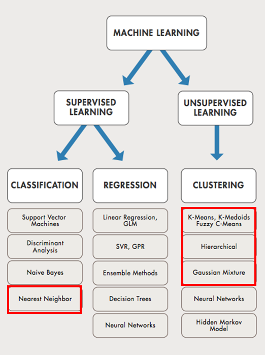
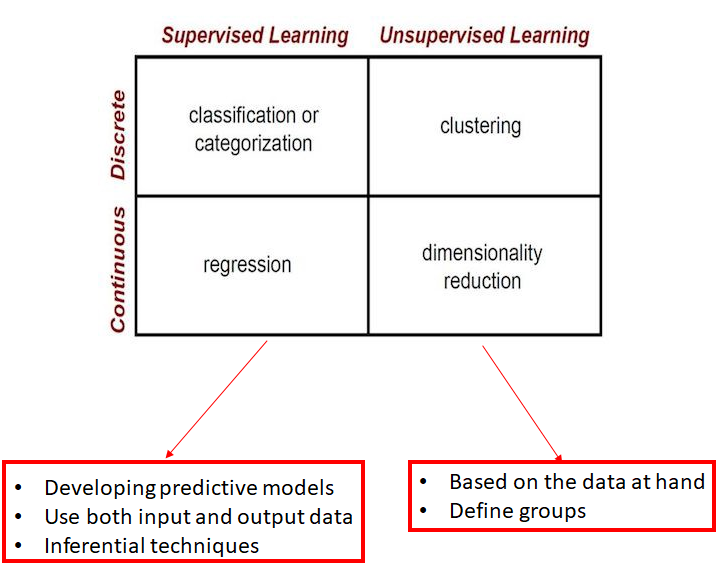
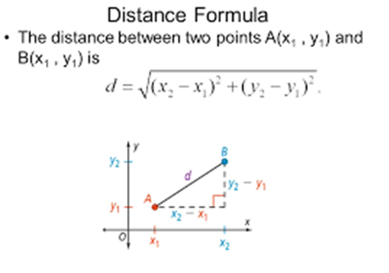
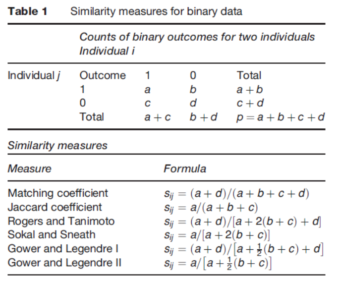
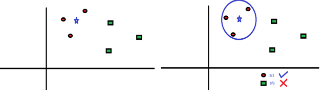
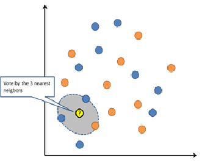

# GENERALITIES

-   Two categories of data classification techniques

    -   Unsupervised (e.g. clustering)

        -   attempts to group objects into sets, without knowing a
            priori labels, and determine relationships between objects.

    -   Supervised (e.g. human-guided classification)

        -   aims to identify or predict predefined classes and label new
            objects as members of specific classes.

-   Machine learning context and jargon

    -   classification is supervised learning and

    -   clustering is unsupervised learning.

-   Some add reinforcement learning too...

## MACHINE LEARNING - a sub-field of Artificial Intelligence

    

{width="517"}

## UNSUPERVISED CLASSIFICATION

-   Groupings with common characteristics are automatically derived
    based on intrinsic affinities and associations in the data without
    human indication of clustering. 

-   From [***unlabeled***]{.ul} to [***guessing label***]{.ul}

-   Unsupervised learning is purely and strongly driven by input data

-   There are *no a priori* correct answers and there is *no human
    guidance*.

-   Clustering (discover the inherent groupings in the data)
    and association (discover association rules that describe the data)
    represent the core unsupervised learning problems.

-   After obtaining a labeled data set, machine learning models can be
    applied to the data so that new unlabeled data can be processed
    using a model and a likely label can be guessed or predicted for
    that piece of unlabeled data.

### EXAMPLE 1 (INTUITIVE): Hot dogs preference

```{r }
hotdog<-read.table("HotDogs_Data_Text.txt",  sep="\t", header=TRUE)
names(hotdog)
dim(hotdog)
hotdog[1:10,]
```

-   An ordinary quick plot

```{r }
plot(hotdog$Calories, hotdog$Sodium, main = "Hotdogs", xlab="Calories", ylab="Sodium", pch=1, col="black")	
```

-   Labeling the data in two ways: using plot function and a ggplot

```{r }
plot(hotdog$Calories, hotdog$Sodium, main = "Hotdogs", xlab="Calories", ylab="Sodium", pch=1, col="black")	
text(hotdog$Calories, hotdog$Sodium, labels=hotdog$Type, cex=0.5, pos=3,  col="black")	

	
gg1_plot = ggplot(hotdog, aes(x=Calories, y=Sodium)) + 
  geom_point(aes(color=Type, shape = Type, stroke = 5),alpha=1) + 
  theme_bw(base_size=15) +	
  guides(colour = guide_legend(override.aes = list(size=5))) +	
  theme(legend.position="top")	
gg1_plot
```

-   Some potential grouping - just trying (manually/visually). No
    particular techniques applied!

```{r }
plot(hotdog$Calories, hotdog$Sodium, main = "Hotdogs", xlab="Calories", ylab="Sodium", pch=1, col="black")	
segments(120, 280, 120, 570, lty=2)	
segments(120, 280, 30, 280, lty=2)	
segments(120, 570, 30, 570, lty=2)	
segments(125, 250, 125, 600, lty=2)	
segments(125, 250, 165, 250, lty=2)	
segments(165, 250, 165, 600, lty=2)	
segments(125, 600, 165, 600, lty=2)	
segments(170, 400, 170, 700, lty=2)	
segments(170, 400, 250, 400, lty=2)	
text(100, 220, "cluster 1",col="black")	
text(140, 200, "cluster 2", col="black")	
text(185, 350, "cluster 3", col="black")	
```

#### Potential interpretation:

-   Cluster 1 - hot dogs of low calories and medium sodium content;
    Cluster 2 - has both calorie and sodium at medium levels; Cluster
    3 - has both sodium and calories at high levels.

-   We can make a bold guess about the meats used in these three
    clusters of hot dogs, i.e.

-   Cluster 1: probably mostly chicken meat since it has low calories.
    Cluster 2: might be beef and Cluster 3: likely to be pork,

-   Beef hot dogs have considerably less calories and salt than pork hot
    dogs.

-   However, this is just guessing. Some hot dogs have a mixture of two
    or three types of meat.

-   The real situation is somewhat similar to what we guessed but with
    some random noise, especially in cluster 2.

### CLUSTER ANALYSIS - A METHOD OF UNSUPERVISED CLASSIFICATION

-   The old idea of organizing alike things into groups underlies all
    aspects of human activity

-   Based on tendency of similar items to group

-   Languages can be thought of as classification systems

-   Prominent examples being animal or plant taxonomies informing
    evolutionary theories in biology

-   in the social sciences, including education, it would typically be
    people that are to be grouped to identify patterns of behaviour,
    achievement, etc.

-   In addition to being a basic human conceptual activity,
    classification is fundamental to many branches of science

#### Cluster analysis - exploratory not inferential

-   Cluster analysis is aimed at uncovering as-yet-unknown groups of
    objects based on similar traits or characteristics or natural
    tendencies

-   Distance matrix, standardization

-   Analogous concepts being unsupervised pattern recognition or
    numerical taxonomy.

-   Cluster analysis is an exploratory technique. Its primary aim is not
    to infer anything about population parameters (no resulting
    p-values) as most statistical methods do

-   Process of looking for labels in the data -- each resulting cluster
    can be a potential candidate for a class

-   Rather to suggest groupings that might form the basis of future
    hypotheses to be investigated.

#### How does the clustering work? Proximity measures

-   Ideal clusters = internally cohesive structures separated from each
    other

-   Criteria needed to make judgments on

    -   Cluster homogeneity (cohesion)

    -   Cluster separation (isolation)

-   Reminder:

    -   The data matrix

    -   Variables standardization

-   To each data matrix we associate another **matrix of distances
    between objects** (also known as matrix of **dis(similarities)**)

-   The **dis(similarity)** definition differs according to the **data
    nature** (i.e. binary, categorical or continuous indeed)

-   **Continuous data**: the Euclidian distance but not only

    -   

-   Generalizing the Euclidian distance to two n-dimensional vectors:

$X=(x_1, x_2,..., x_n)$

$Y=(y_1, y_2,..., y_n)$

$d(X, Y)=\sqrt{(x_1-y_1)^2+(x_2-y_2)^2 +...+(x_n-y_n)^2}$

-   **Binary** data:

{width="521"}

#### Re-scaling concepts reminder

-   Different features in the data might have different scales. For
    example, we can have a measure of pain scaling from one to ten or
    one to one hundred. They could be transferred in to same scale.
    Re-scaling can make each feature contributes to the distance in a
    relatively equal manner.

-   **Z-score standardization** -This is based on the properties of
    normal distribution. After z-score standardization, the re-scaled
    feature will have unbounded range representing the number of
    standard deviations of each variable from the mean

$$X\rightarrow X_{new}=\frac{X-mean(X)}{SD(X)}$$

-   **Min-max normalization:** After re-scaling the, the variable would
    range from 0 to 1. It measures the distance between each value and
    its minimum as a percentage. The larger a percentage the further a
    value is from the minimum.

$$X\rightarrow X_{new}=\frac{X-min(X)}{max(X)-min(X)}$$

-   Techniques used in different circumstances:

    -   z-score is different from the min-max normalization that has a
        designed range from 0 to 1, applicable to normal data.

    -   min-max applicable to mixture of types of variables

        -   stays the same for binary

        -   bring the counts to 0-1 range

### CLUSTER METHODS IMPLEMETED IN R - INBUILT READILY AVAILABLE FUNCTIONS

-   Hierarchical clustering

    -   Members of this class of clustering techniques produce a nested
        sequence of partitions by merging (or dividing) clusters

    -   At each stage of the sequence, the new partition is optimally
        merged (or divided) from the previous partition according to
        some adequacy criterion.

    -   The whole series of partitions is most conveniently described by
        a tree display called the dendogram

-   K-means

    -   Partitioning around centroids (center of the cluster)

    -   Sometimes inconsistent

-   M - clustering

    -   Model based clustering suited to normal multivariate data

-   R has excellent clustering inbuilt functionalities

### EXAMPLE 2: European protein consumption data

Protein consumption for 25 European countries is measured as grams of
protein food per day (1975 data) for 9 types of food. Do countries
NATURALLY group upon protein consumption?

#### READ THE DATA

```{r }
protein_data<-read.table("Country_protein.txt",  sep="\t", header=TRUE)
protein_data[1:10,]
```

#### ELIMINATE THE ID VARIABLE

```{r }
##need to get rid of the Ids, i.e. countries - so we will work with a data set which excludes the IDs
protein_data [1:10,-1]
summary(protein_data[,-1])
```

#### DATA STANDARDIZATION

```{r }
di_z<-as.data.frame(lapply(protein_data[,-1], scale))
str(di_z)
```

#### CALCULATE THE DIS(SIMILARITY) MATRIX

```{r }
dis = dist(di_z)
dis
```

### HIERARCHICAL CLUSTERING METHODS

```{r }

##Using the furthest neighbour distance  

hc_complete<-hclust(dis, method = "complete")
plot(hc_complete, hang = -1,labels=protein_data$Country, main="Cluster denodogram. Method - complete")

##MergES two clusters when their nearest neighbour distance is minimal

hc_single<-hclust(dis, method = "single")
plot(hc_single, hang = -1,labels=protein_data$Country,main="Cluster denodogram. Method - single")

##Using distances between clusters’ centroids  

hc_ward<-hclust(dis, method = "ward.D")
plot(hc_ward, hang = -1,labels=protein_data$Country, main="Cluster denodogram. Method - ward")

```

### K-MEANS CLUSTERING

```{r }
###OPTIMIZATION CLUSTERING 
protein_data.stand <- scale(protein_data[-1])
protein_data.stand[1:10, ] ##normalized data
di_z[1:10,] ##normalized data

set.seed(134589)
k.means.fit <- kmeans(protein_data.stand, 3) # k = 3
attributes(k.means.fit)
k.means.fit$centers ##DISPLAYS THE MEAN FEATURE VALUES FOR EVERY CENTER
k.means.fit$cluster ##VECTOR INDICATING THE CULUSTER NUMBER FOR EACH OBSERVATION
k.means.fit$size    ##DISPLAYS HOW MANY OBSERVATIONS ARE ASSIGNED TO EACH CLUSTER
```

#### ADDING THE GROUPING VARIABLE TO THE DATA

```{r }
##you can always add the grouping to the data and further analyse it for inference
protein_data$cluster_group<-k.means.fit$cluster
protein_data[1:10, ]
```

### SILHOUETTE PLOTS IN R: Visualizing (DI)similarities

-   The technique provides a succinct graphical representation of how
    well each object lies within its cluster.

-   The silhouette value is a measure of **how similar** an object is to
    its own cluster (**cohesion**) compared to other clusters
    (**separation**).

-   The silhouette ranges from −1 to +1. A high value indicates

    -   the object is well matched to its own cluster

    -   poorly matched to neighbouring clusters.

-   Large values indicate - the clustering configuration is appropriate.

-   Low or negative value - the clustering configuration may have too
    many or too few clusters.

-   Silhouette plots rely on a distance metric: Euclidian, or can be
    other type of distances.

```{r }
sil1=silhouette(k.means.fit$cluster, dis)
summary(sil1)
plot(sil1, cex=0.5)
```

#### INTERPRETATION

-   Silhouette plots represent the most appropriate evaluation strategy
    to assess the quality of the clustering.

-   This graph shows that 4 data points correspond to a negative
    Silhouette values, suggesting these cases may be "mis-clustered", or
    perhaps are ambiguous as the Silhouette value is close to 0.

```{r }
clusplot(protein_data.stand, k.means.fit$cluster, main='2D representation of the Cluster solution',
         color=TRUE, shade=TRUE,
         labels=2, lines=0,) ##NOT GREAT ISN'T IT?


par(mfrow=c(1, 1), mar=c(4, 4, 4, 2))	
myColors <- c("darkblue", "red", "green", "brown", "pink", "purple", "yellow", "orange", "magenta")	
barplot(t(k.means.fit$centers), beside = TRUE, xlab="cluster", 	
        ylab="value", col = myColors)	
legend("topright", ncol=1, legend = c("RedMeat", "WhiteMeat", "Eggs", "MILK", "Fish", "Cereals", "Starch", "Nuts", "Fr.Veg"), fill = myColors)	

```

#### TRY FEWER CLUSTERS

```{r }

###OPTIMIZATION CLUSTERING 
protein_data.stand <- scale(protein_data[-1])
protein_data.stand[1:10, ] ##normalized data
di_z[1:10,] ##normalized data

set.seed(134589)
k.means.fit <- kmeans(protein_data.stand, 2) # k = 2
attributes(k.means.fit)
k.means.fit$centers ##DISPLAYS THE MEAN FEATURE VALUES FOR EVERY CENTER
k.means.fit$cluster ##VECTOR INDICATING THE CULUSTER NUMBER FOR EACH OBSERVATION
k.means.fit$size    ##DISPLAYS HOW MANY OBSERVATIONS ARE ASSIGNED TO EACH CLUSTER
```

```{r }
sil1=silhouette(k.means.fit$cluster, dis)
summary(sil1)
plot(sil1, cex=0.5)
```

```{r }
clusplot(protein_data.stand, k.means.fit$cluster, main='2D representation of the Cluster solution',
         color=TRUE, shade=TRUE,
         labels=2, lines=0,) ##NOT GREAT ISN'T IT?


par(mfrow=c(1, 1), mar=c(4, 4, 4, 2))	
myColors <- c("darkblue", "red", "green", "brown", "pink", "purple", "yellow", "orange", "magenta")	
barplot(t(k.means.fit$centers), beside = TRUE, xlab="cluster", 	
        ylab="value", col = myColors)	
legend("topright", ncol=1, legend = c("RedMeat", "WhiteMeat", "Eggs", "MILK", "Fish", "Cereals", "Starch", "Nuts", "Fr.Veg"), fill = myColors)	

```

#### DECIDING THE IDEAL NUMBER OF CLUSTERS - SCREE PLOT

Rule of thumb $k=\sqrt{\frac{n}{2}}$

```{r }

wssplot <- function(data, nc=15, seed=1234){
  wss <- (nrow(data)-1)*sum(apply(data,2,var))
  for (i in 2:nc){
    set.seed(seed)
    wss[i] <- sum(kmeans(data, centers=i)$withinss)}
    plot(1:nc, wss, type="b", xlab="Number of Clusters",
       ylab="Within groups sum of squares")}


wssplot(protein_data.stand, nc=10) ##SUGGESTIVE FOR THE NUMBER OF CLUSTERS
wssplot(protein_data.stand, nc=4) ##SUGGESTIVE FOR THE NUMBER OF CLUSTERS
```

#### FORMAL METHODS TO DECIDE THE NUMBER OF CLUSTERS

```{r }
gmm_clust=Mclust(di_z)
plot(gmm_clust$BIC, legendArgs=list(x="right", ncol=2, cex=1))
plot(gmm_clust, what="density")
plot(gmm_clust, what="classification")
```

#### REFLECTING ON CLUSTERING USING PAIRWISE BIVARIATE DISTRIBUTION

```{r }
gmm_clust=Mclust(di_z)
plot(gmm_clust, what="density")
plot(gmm_clust, what="classification")
```

#### FITTING THE IDEAL NUMBER OF CLUSTERS

```{r }
###OPTIMIZATION CLUSTERING 
protein_data.stand <- scale(protein_data[-1])
protein_data.stand[1:10, ] ##normalized data
di_z[1:10,] ##normalized data

set.seed(134589)
k.means.fit <- kmeans(protein_data.stand, 4) # k = 4

sil1=silhouette(k.means.fit$cluster, dis)
summary(sil1)
plot(sil1, cex=0.5)

clusplot(protein_data.stand, k.means.fit$cluster, main='2D representation of the Cluster solution',
         color=TRUE, shade=TRUE,
         labels=2, lines=0,) ##NOT GREAT ISN'T IT?


par(mfrow=c(1, 1), mar=c(4, 4, 4, 2))	
myColors <- c("darkblue", "red", "green", "brown", "pink", "purple", "yellow", "orange", "magenta")	
barplot(t(k.means.fit$centers), beside = TRUE, xlab="cluster", 	
        ylab="value", col = myColors)	
legend("topright", ncol=1, legend = c("RedMeat", "WhiteMeat", "Eggs", "MILK", "Fish", "Cereals", "Starch", "Nuts", "Fr.Veg"), fill = myColors)	
```

## SUPERVISED LEARNING

-   Create a [**training data set**]{.ul} that have classified examples
    labeled by nominal variables and different features in ordinal or
    numerical variables.

-   Create a [**test data set**]{.ul} containing unlabeled examples with
    similar features with the training data.

-   Handwriting recognition (such as recognizing handwritten digits)

-   Classifying images of objects (e.g. tumour type?) or diseased from
    non-diseased

### LAZY LEARNING: k-nearest neighbor (kNN)

-   Lazy learners simply store the training data and wait until a
    testing data appear.

-   When it does, classification is conducted based on the most related
    data in the stored training data.

-   Compared to eager learners, ***lazy learners have less training time
    but more time in predicting***.

-   [***k-Nearest Neighbour (kNN)***]{.ul} is a lazy learning algorithm
    which stores all instances correspond to training data points in
    n-dimensional space.

-   When an unknown discrete data is received, it analyses the closest k
    number of instances saved (nearest neighbours) and

    -   returns the most common class as the prediction

    -   for real-valued data it returns the mean of k nearest neighbors.

-   Deep learning -- a more advanced method of data classification

    {width="622"}

    {width="333"}

#### kNN formal steps

-   Data retrieval and normalization

-   Splitting the data into training and testing sets

-   Fitting models on the training data

-   Evaluating model performance on testing data

-   Improving model performance

-   Determining optimal values of k

#### EXAMPLE: Boys Town Study of Youth Development

-   **ID**: Case subject identifier

-   **Sex**: dichotomous variable (1=male, 2=female)

-   **GPA**: Interval-level variable with range of 0-5 (0-"A" average,
    1- "B" average, 2- "C" average, 3- "D" average, 4-"E", 5-"F"")

-   **Alcohol use**: Interval level variable from 0-11 (drink everyday -
    never drinked)

-   **Attitudes on drinking in the household**: Alcatt-Interval level
    variable from 0-6 (totally approve - totally disapprove)

-   **DadJob**: 1-yes, dad has a job and 2- no

-   **MomJob**:1-yes and 2-no

-   **Parent closeness** (example: In your opinion, does your mother
    make you feel close to her?)

    -   Dadclose: Interval level variable 0-7 (usually-never)

    -   Momclose: interval level variable 0-7 (usually-never)

-   **Delinquency**:

    -   larceny(how many times have you taken things \>\$50?): Interval
        level data 0-4 (never-many times),

    -   vandalism: Interval level data 0-7 (never - many times)

-   **Question: Would it be possible to classify a new individual and to
    predict the GPA score?**

    -   We can classify it into two categories: below average or above
        average.

        -   Whoever gets a "C" or higher - "above average" category;

        -   Whoever gets below "C" -"average or below" category.

```{r }
boystown<-read.table("CaseStudy02_Boystown_Data_text.txt",  sep="\t", header=TRUE)
names(boystown)
dim(boystown)
str(boystown)


boystown$sex<-boystown$sex-1
boystown$dadjob<--1*(boystown$dadjob-2)
boystown$momjob<--1*(boystown$momjob-2)
str(boystown)

#the ID variable is not important in this case study so we can delete it
boystown<-boystown[, -1]
table(boystown$gpa) 
```

#### THE OUTCOME

-   The variable of most interest is the GPA variable. We can classify
    it into two categories.

    -   Whoever gets a "C" or higher will be classified into the "above
        average" category.

    -   Students who have average score below "C" will be in the
        "average or below" category. These two are the classes of
        interest for this case study.

```{r }
boystown$grade<-boystown$GPA %in% c(3, 4, 5)
boystown$grade<-factor(boystown$grade, levels=c(F, T), labels = c("above_avg", "avg_or_below"))
table(boystown$grade)

##proportions for the two categorizes rounded 
round(prop.table(table(boystown$grade))*100, digits=2)

```

```{r }

##The remaining 10 features are all numeric but with different scales. ##
##If we use these features directly, the ones with larger scale will have a greater impact on 
##the classification performance. Therefore, re-scaling is needed in this scenario.

summary(boystown[c("Alcoholuse", "larceny", "vandalism")])
```

-   Create a function of our own using the min-max normalization
    formula.

```{r }
normalize<-function(x){
  return((x-min(x))/(max(x)-min(x)))
}

normalize(c(1, 2, 3, 4, 5))
```

### WORKING ON THE NORMALIZED DATA

```{r }
boystown_n<-as.data.frame(lapply(boystown[-11], normalize))
summary(boystown_n$Alcoholuse)
summary(boystown_n$larceny)
summary(boystown_n$vandalism)
```

#### CREATE THE TRAINING DATA AND TESTING DATA

```{r }
bt_train<-boystown_n[1:150, ]
bt_test<-boystown_n[151:200, ]

##extract the labels
bt_train_labels<-boystown[1:150, 11]
bt_test_labels<-boystown[151:200, 11]
```

#### MODEL ON THE TRAINING DATA

-   The function knn() has following ARGUMENTS:

-   [***train:***]{.ul} data frame containing numeric training data
    (features)

-   [***test:***]{.ul} data frame containing numeric testing data
    (features)

-   [***class***]{.ul}: class for each observation in the training data

-   [***k***]{.ul}: predetermined integer indication the number of
    nearest neighbors - trial and error - first starting choice can be
    $\sqrt{n}$ (here $\sqrt{200}$\~14)

```{r }
##TRAINING
bt_test_pred<-knn(train=bt_train, test=bt_test, cl=bt_train_labels, k=14)
##CROSS VALIDATION
CrossTable(x=bt_test_labels, y=bt_test_pred, prop.chisq = F)
```

-   The accuracy in this case is calculated
    by:(cell[1,1]+cell[2,2])/total

-   Can we improve the performance?

```{r }
bt_z<-as.data.frame(scale(boystown[, -11]))
summary(bt_z$Alcoholuse)

bt_train<-bt_z[1:150, ]
bt_test<-bt_z[151:200, ]
bt_train_labels<-boystown[1:150, 11]
bt_test_labels<-boystown[151:200, 11]
bt_test_pred<-knn(train=bt_train, test=bt_test, 
                  cl=bt_train_labels, k=14)
CrossTable(x=bt_test_labels, y=bt_test_pred, prop.chisq = F)
```

-   The accuracy in this case is calculated
    by:(cell[1,1]+cell[2,2]/total)

### TESTING ALTERNATIVE NUMBERS OF k

```{r }
bt_train<-boystown_n[1:150, ]
bt_test<-boystown_n[151:200, ]
bt_train_labels<-boystown[1:150, 11]
bt_test_labels <-boystown[151:200, 11]
bt_test_pred1 <-knn(train=bt_train, test=bt_test,  cl=bt_train_labels, k=1)
bt_test_pred5 <-knn(train=bt_train, test=bt_test,  cl=bt_train_labels, k=5)
bt_test_pred11<-knn(train=bt_train, test=bt_test,  cl=bt_train_labels, k=11)
bt_test_pred21<-knn(train=bt_train, test=bt_test,  cl=bt_train_labels, k=21)
bt_test_pred27<-knn(train=bt_train, test=bt_test,  cl=bt_train_labels, k=27)

ct_1 <-CrossTable(x=bt_test_labels, y=bt_test_pred1,  prop.chisq = F)
ct_5 <-CrossTable(x=bt_test_labels, y=bt_test_pred5,  prop.chisq = F)
ct_11<-CrossTable(x=bt_test_labels, y=bt_test_pred11, prop.chisq = F)
ct_21<-CrossTable(x=bt_test_labels, y=bt_test_pred21, prop.chisq = F)
ct_27<-CrossTable(x=bt_test_labels, y=bt_test_pred27, prop.chisq = F)
```

-   The choice of k in KNN clustering is very important. The optimal
    value of K is that which minimizes the error of the
    cross-validation.

```{r }
knntuning = tune.knn(x= bt_train, y = bt_train_labels, k = 1:30)
knntuning
summary(knntuning)
```

## k-MEANS vs. kNN

-   **K-mean**

    -   an unsupervised learning technique (no dependent variable)

    -   a clustering technique which tries to split data points into
        K-clusters such that the points in each cluster tend to be near
        each other

-   **kNN**

    -   a supervised learning algorithm (dependent variable exists)

    -   tries to determine the classification of a point, combines the
        classification of the K nearest points

## LAZY LEARNING WRAPPING UP

-   Classification tasks could be very difficult when the features and
    target classes are numerous, complicated or extremely difficult to
    understand.

-   In those scenarios where the items of similar class type tend to be
    homogeneous, nearest neighbor classifying method are well-suited
    because assigning unlabeled examples to most similar labeled
    examples would be fairly easy.

-   Such classification method can help us to understand the story
    behind the unlabeled data using known data avoiding analyzing those
    complicated features and target classes.

-   This is because it has no distribution assumptions. However, this
    non-parametric manner makes the method rely heavy on the training
    instances. Thus, it is considered a "lazy" algorithm.
